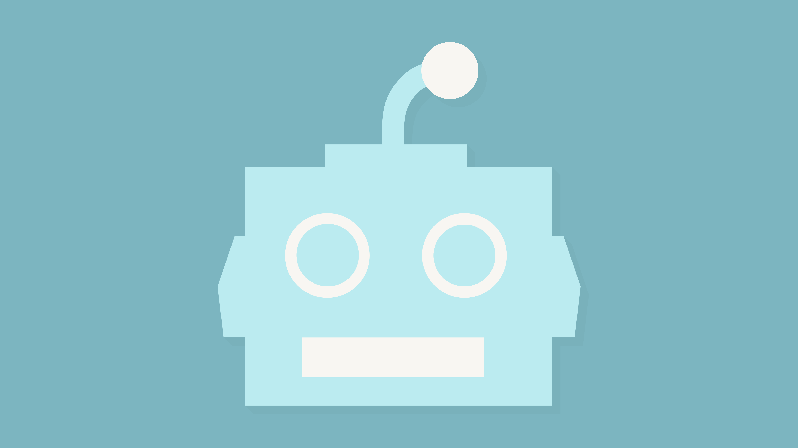

  

<h1 style='text-align: center;'>BUDDY BOT — A PROGRAMMER'S BEST BUDDY</h1>

### Buddy Bot is an interactive chatbot designed to help a user with all of their programming needs. It was created with the intention of helping users along in their programming journey, whether they be beginners or professionals.

 

## Project Structure

Buddy Bot was built with an HTML/CSS/Vanilla JS front-end, a Python back-end, and a MySQL database. At it's heart, Buddy Bot is built off of the Google BERT NLP to answer questions accurately and with ease, and ChatterBot to have fun and quirky conversations when you need a break.

## What You Need

Below is a list of packages/requirements needed to built Buddy Bot locally. Any stable version of Python 3.6.x will be sufficient.

The following packages can be installed with `pip`:

- `requests`
- `mysql.connector`
- `flask`
- `flask_cors`
- `tensorflow`
- `tensorflow_hub`
- `transformers`
- `chatterbot`
- `chatterbot_corpus`
- `bs4`
- `tldextract`

## How To Use

To use Buddy Bot is simple. Just execute the `buddyBotController.py` file, and open up the `index.html` in your browser. You'll want to make sure that the fetch requests are pointed toward `localhost:5000`, though, or else any chatting you do will not work.

-----

Buddy Bot was meant to be educational first and foremost, but also a bit of fun on the side. For some users, the ChatterBot will accomplish this. But for the especially curious, clicking around the page just may surprise you. If you click in just the right spot (we aren't going to tell you where that is, what's the fun in that?), you'll be greeted with a fun surprise...

  

<h1 style='text-align: center;'>EVIL BOT — A PROGRAMMER'S WORST NIGHTMARE</h1>

You're greeted with Evil Bot!

Evil Bot is witty, stubborn, and loves to joke around. Every question you ask, instead of answering, Evil Bot just responds sarcastically. It's quite comical, really. And we all need a bit of comedic relief these days, don't we?

Don't worry, though. If you were able to switch to evil mode with the proper click, you can switch back just as easily, in the event that you do have questions to ask.

 

Happy Asking!